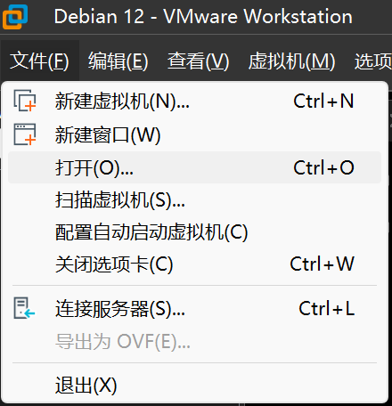
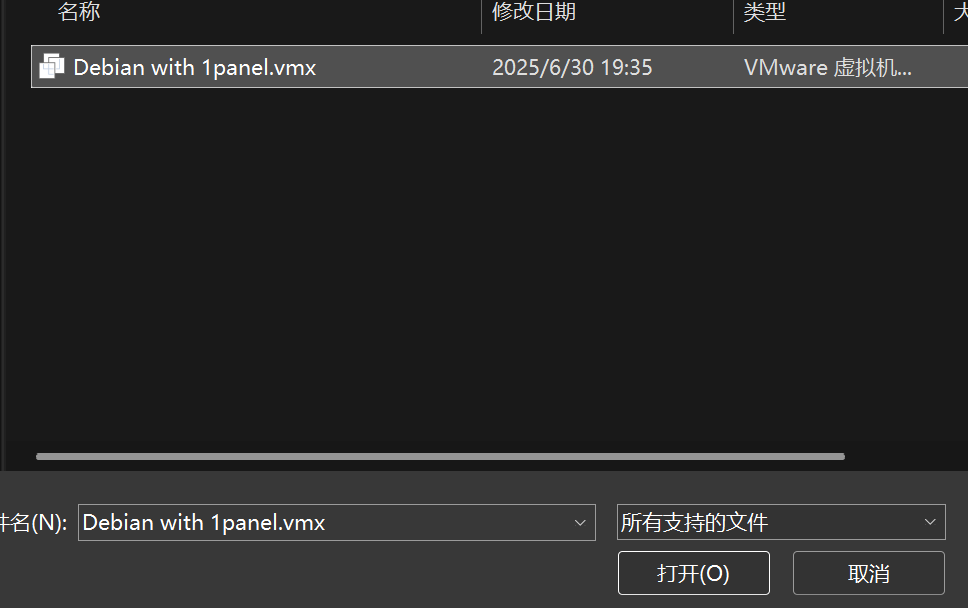
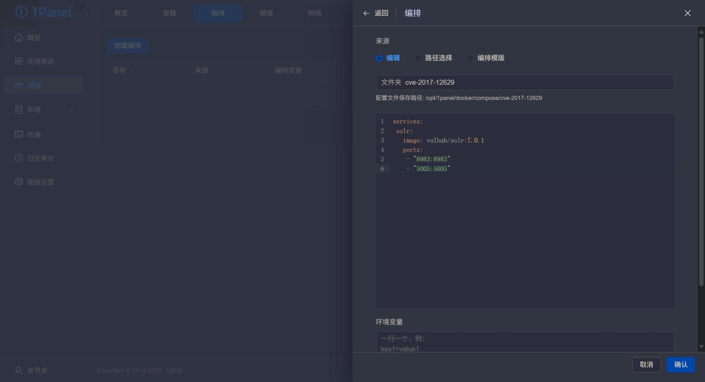

# 开箱即用的debian+Docker虚拟机

本文档包含开箱即用教程和具体实现细节。

## 开箱即用教程

### 加载方法

使用VMware的 *打开* 功能，选择vmx文件加载虚拟机。



### 系统用户

根用户root，密码：asdfghjkl，关闭SSH登录。

用户user，密码：asdfghjkl，允许SSH登录，端口22，已配置sudo。

### docker与docker-compose图形化

已安装docker，并配置好镜像源。

使用1panel实现对docker的图形化管理，访问端口12345，用户名user，密码asdfghjkl。

可在【容器->编排->创建编排】中创建docker-compose项目。



## 实现细节

### 虚拟机配置

4C4G，UEFI启动，[北京外国语大学镜像源](https://mirrors.bfsu.edu.cn)。

### docker安装

使用针对中国网络优化的docker安装脚本完成docker的安装。

```shell
bash <(curl -sSL https://linuxmirrors.cn/docker.sh)
```

> 也可直接使用1panel安装脚本，其会自动安装docker。
>
> ```shell
> bash -c "$(curl -sSL https://resource.fit2cloud.com/1panel/package/v2/quick_start.sh)"
> ```

### docker加速

使用[毫秒镜像](https://1ms.run/)作为docker加速服务，修改`/etc/docker/daemon.json`文件为如下内容：

```shell
{
  "registry-mirrors": ["https://docker.1ms.run"]
}
```

> 在使用上述安装脚本时，该操作自动完成。

### docker图形化

使用开源服务器面板[1panel](https://1panel.cn/)实现对docker项目的图形化管理，被隐藏的面板菜单可以在【面板设置->面板->菜单设置】中开启。
